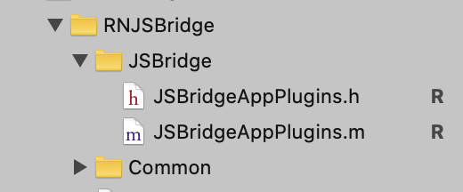

# rn-jsbridge-ios

一个利用`RCTBridgeModule`实现`react-native`版本的`jsbridge`.

## 如何使用

1. **拷贝 ios-> RNJSBridge 目录下的所有文件**

2. **在项目启动/调用 bridge 之前 注册 jsbridge**

`[[RNJSBridgeRegister shareInstance] registerJSBridge];`

3. 在 RNJSBridge->JSBridge 目录下编写自己的 jsbridge。
   

## 如何编写自定义 jsbrige

首先要清楚整个 jsbridge 的格式如下:

```bash
jsbridge://moduleName/methodName?params=value1&params2&value2
```

- `jsbridge` 是按照 `module` 划分的，意味着我们需要在一个模块下编写对应的 bridge

- 自定义 `jsbridge`需要继承`JSBridgeCommonBase`

- 在编写 `jsbridge` 时，实现对应的方法需要注意，方法名称必须为`evaluateJSBridge_你的方法名称`，且入参为一个`BridgeRequest`对象

- 如果有需要回调，可以在方法中调用`evaluateJSCallback`执行回调

上面讲述可能比较晦涩，下面拿一个具体的例子讲述; 假如我们要使用

```js
// 第一个参数app为模块名称,第二个参数为方法名称
callWithCallback('app', 'getAppInfo', {}, (data) => {
  this.setState({
    msg: JSON.stringify(data),
  });
});
// 或者
JSBridge.app.getAppInfo((data) => {});
```

的方式调用 jsbridge 获取系统信息；那么我们 ios 端应该如下:

1. 创建一个文件`JSBridgeAppPlugins`并继承`JSBridgeCommonBase`
2. 实现`evaluateJSBridge_getAppInfo`方法
   - 由于需要回调，我们可以在方法中调用`evaluateJSCallback`执行回调

```java
// 一个样例，获取App的信息，使用callback返回
- (void)evaluateJSBridge_getAppInfo:(BridgeRequest *)request{
  NSString *deviceName = [[UIDevice currentDevice] name];
  NSString *sysVersion = [[UIDevice currentDevice] systemVersion];
  NSString *deviceUUID = [[[UIDevice currentDevice] identifierForVendor] UUIDString];
  // 执行js回调
  [self evaluateJSCallback:@{
    @"deviceName":deviceName,
    @"sysVersion":sysVersion,
    @"uuid":deviceUUID
  }withRequest:request];
}

```

3. 在`RNJSBridgeRegister`注册自定义`JSBridgeAppPlugins`

```java
// 注意app必须和上面是有的module名称相同
jsBridgePlugins = [[NSMutableDictionary alloc] initWithDictionary: @{
    @"app":[JSBridgeAppPlugins class]
  }];
```

## 如何实现
